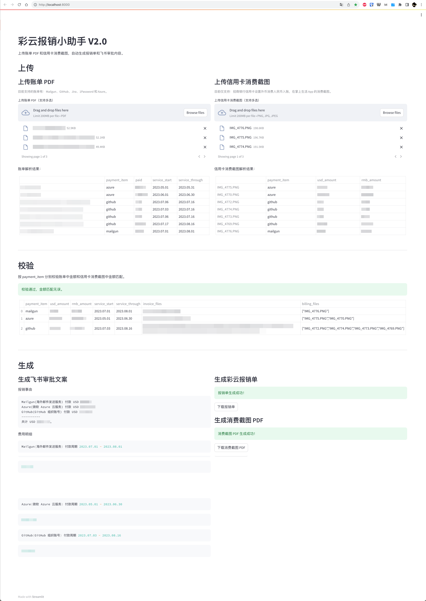

# caiyun-reimbursement-assistant

[](https://github.com/mrchi/reimbursement-assistant/actions/workflows/linting.yaml)
[](https://github.com/mrchi/reimbursement-assistant/actions/workflows/unittest.yaml)

这是一个用于快速提交报销申请的小助手，彩云科技限定。



## 主要功能

1. 解析 invoice / receipt PDF 文件，提取订阅周期和美元付款金额，目前支持以下账单类型：
    - Jira；
    - Mailgun；
    - GitHub；
    - 1Password；
    - Microsoft Azure；
2. 解析信用卡消费截图，提取人民币入账金额和原始美元消费金额，目前仅支持：
    - 招行信用卡开启外币消费人民币入账，在掌上生活 App 截图；
3. 校验双端金额匹配，避免漏传文件或截图；
4. 生成财务报销单文件和消费截图拼接 PDF；
5. 生成飞书报销申请文案内容。

## 它花钱吗

在解析信用卡消费截图时，需要调用阿里云的通用文字识别 API，API 收费但每月有 200 次 API 免费额度。

并且通过 streamlit 做了缓存，同一个文件重复上传会走缓存不再调用 API。

## 使用方法

首先开通阿里云的通用文字识别服务并创建一个 AccessKey；
- [阿里云读光OCR 控制台](https://ocr.console.aliyun.com/overview)
- [阿里云 AccessKey 管理](https://ram.console.aliyun.com/manage/ak)

准备一个 Python3 的环境并安装依赖：

```zsh
pipenv sync
```

准备好财务指定的报销申请表模板文件，放到 data 目录下，例如：

```zsh
❯ ll data
total 392
-rw-r--r--  1 chi  staff   195K Aug 11 23:32 彩云财务表格-220221.xlsm
```

创建配置文件并补充以下信息：
- 阿里云 AccessKey 信息；
- 报销申请表模板文件路径；
- 报销人姓名。

```zsh
cd .streamlit/
cp secrets-example.toml secrets.toml
```

万事俱备，启动服务

```zsh
streamlit app/stapp.py
```

访问 http://localhost:8000 开启旅程。

## 技术实现

- 使用 PyMuPDF 读取账单 PDF，用关键字匹配属于哪个账单类型，用正则提取信息；
- 使用阿里云文字识别 API 读取信用卡消费截图，用关键字匹配属于哪个账单类型，用正则提取信息；
- 使用 openpyxl 读取和编辑报销申请表模板文件；
- 使用 PyMuPDF 拼接生成消费截图 PDF。

没有用 ChatGPT，优点是正则匹配的结果几乎 100% 准确，缺点是扩展新的账单类型时需要手撸正则。

## Next

- 调用飞书开放平台 API 提交申请，实现全流程覆盖；
- ~~将所有需要打印的 PDF 文件按顺序拼接成一个打印专用 PDF，简化打印操作；~~
- 使用 ChatGPT 总结提取信息，在保证准确性的同时，增强可扩展性。
